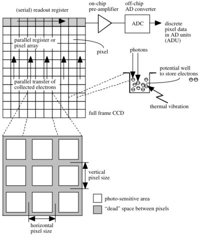

```{r, echo=FALSE, results='hide', cache=TRUE}
options(OutDec=",")

## Nous allons utiliser aujour'hui deux jeux de données :
## http://xtof.disque.math.cnrs.fr/data/Gain.2nd.RData, que nous avons déjà commencé à
## utiliser lors du dernier cours, ce sont les données de calibration du capteur CCD ;
## http://xtof.disque.math.cnrs.fr/data/POMC.txt, un jeu de données d'un neurone de
## l'hypothalamus synthétisant la pro-opiomélanocortine (http://fr.wikipedia.org/wiki/Pro-opiomélanocortine) (POMC).
## Ces deux jeux de données ont été enregistrés par Andreas Pippow dans le laboratoire
## de Peter Kloppenburg à l'Université de Cologne.
## Le fichier contenant les données POMC.txt est au format `ASCII` et ses 6 premières
## lignes sont une description textuelle des données et donnent les indications de lecture.
## Ici, il nous suffit de faire :
tmp <- scan("http://xtof.disque.math.cnrs.fr/data/POMC.txt",skip=6)
time <- tmp[1:168]
stack <- array(tmp[-(1:168)],dim=c(60,80,168))
rm(tmp)
```

```{r, echo=FALSE}
plotSignal = function(stack,lwd=1){
    nX = dim(stack)[1]; nY = dim(stack)[2]; nT= dim(stack)[3]
    dynRange = range(stack)
    xRange = c(0,nX*nT); yRange = c(0,nY)
    old.par = par(mar=c(3,1,2,1))
    on.exit(par(old.par))
    plot(xRange,yRange,type="n",
         xaxs="i",xaxt="n",yaxs="i",yaxt="n")
    dynDiff = diff(dynRange)	
    for(cIdx in 1:nY) {
        for (rIdx in 1:nX) {
            xMin = 1+(rIdx-1)*nT; xMax = rIdx*nT
            yMin = (cIdx-1); yMax = cIdx
            rect(xMin,yMin,xMax,yMax,border="grey90",lwd=lwd)
            sig = stack[rIdx,cIdx,]
            adu340 = (sig-dynRange[1])/dynDiff + (cIdx-1)
            theTime = xMin:xMax
            lines(theTime,adu340,lwd=lwd) } } }
```

# Introduction

## La variabilité inhérente aux données de fluorescence (1) {.smaller}

```{r,fig.width=6.5,fig.height=4.5,fig.align='center',echo=FALSE}
plotSignal(stack[24:35,34:43,],lwd=1.5)
```
Données brutes (ADU), Fura-2 excité à 340 nm. 25,05 s et mêmes échelles sur chaque sous-graphe.

## La variabilité inhérente aux données de fluorescence (2) {.smaller}

```{r, fig.align='center',echo=FALSE}
plot(time,stack[29,39,],
     xlab="Temps (s)",
     ylab="Comptage (ADU)",
     type="l",lwd=3)
```
L'un des pixels centraux de la figure précédente.

## Que cherche-t-on ?

À partir des données que nous venons de voir, nous pourrions vouloir estimer des paramètres comme :

- l'amplitude au pic ;
- la constante de temps de retour à l'« équilibre » ;
- le niveau de base ;
- le décours temporel complet -- c.-à-d. une fonction à strictement parler.

Nous pourrions aussi considérer un modèle liant la dynamique calcique -- le décours temporel de la concentration de calcium libre dans la cellule -- à l'intensité de fluorescence :
$$\frac{\mathrm{d}Ca_t}{\mathrm{dt}} \left(1 + \kappa_{F}(Ca_t) + \kappa_{E}(Ca_t) \right) + \frac{j(Ca_t)}{v} = 0 \, , $$

*** 

où $Ca_t$ représente la $[Ca^{2+}]_{libre}$ au temps t, $v$ est le volume du neurite -- à l'intérieur duquel les effets de diffusion peuvent être négligés -- et
$$j(Ca_t) \equiv \gamma (Ca_t - Ca_{station.}) \, ,$$
modélise l'extrusion du calcium -- $Ca_{station.}$ est la $[Ca^{2+}]_{libre}$ stationnaire --
$$\kappa_{F}(Ca_t) \equiv \frac{F_{total} \, K_{F}}{(K_{F} + Ca_t)^2} \quad \mathrm{et} \quad \kappa_{E}(Ca_t) \equiv \frac{E_{total} \, K_{E}}{(K_{E} + Ca_t)^2} \, ,$$
où $F$ désigne le fluorophore et $E$ le(s) tampon(s) _endogène(s)_.


***

Quand nous travaillons avec ce type de modèle, nous supposons que les paramètres du fluorophore (le Fura) : $F_{total}$ et $K_F$ ont été calibrés ; nous pourrions vouloir estimer :

- le paramètre d'extrusion : $\gamma$
- les paramètres du tampon endogène : $E_{total}$ et $K_E$.

en utilisant une équation reliant l'intensité de fluorescence au calcium :
$$Ca_t = K_{F} \, \frac{S_t - S_{min}}{S_{max} - S_t} \, ,$$
où $S_t$ est la fluorescence mesurée au temps $t$, $S_{min}$ et $S_{max}$ sont des paramètres _calibrés_ correspondant à la fluorescence en absence de calcium et en calcium « saturant ». 

***

- la variabilité de notre signal implique que nos paramètres estimés vont fluctuer d'une réplication à l'autre;
- formellement, nos paramètres estimés sont modélisés par des _variables aléatoires_ et __il n'est pas suffisant de résumer une variable aléatoire par un nombre__ ;
- si nous ne pouvons pas obtenir la loi d'échantillonage complète de nos paramètres, nous voulons au moins fournir un intervalle à l'intérieur duquel la vraie valeur du paramètre se trouve avec une probabilité donnée ;
- dit autrement : **une analyse sans intervalle de confiance n'est pas une analyse** puisque ses résultats ne sont pas reproductibles -- si j'écris que ma constante de temps est 25,76 ms, la probabilité d'obtenir 25,76 ms en répliquant l'expérience est essentiellement 0 ; si j'écris que la vraie constante de temps a une probabilité de 0,95 de se trouver dans l'intervalle [24,0 ; 26,5], je peux comparer ce résultat avec celui obtenu lors d'une réplication.

## L'importance de la prise en compte de la variabilité
Considérons un modèle de génération de données très simple :
$$Y_i \sim \mathcal{P}(f_i)\, , \quad i=0,1,\ldots,K \; ,$$
où $\mathcal{P}(f_i)$ désigne une _loi de Poisson_ de paramètre $f_i$ :
$$\mathrm{Pr}\{Y_i = n\} = \frac{(f_i)^n}{n!} \exp (-f_i)\, , \quad \mathrm{pour} \quad n=0,1,2,\ldots $$
et
$$f_i = f(\delta i| f_{\infty}, \Delta, \beta) = f_{\infty} + \Delta \, \exp (- \beta \, \delta i)\; ,$$
$\delta$ est un pas de temps et $f_{\infty}$, $\Delta$ et $\beta$ sont les paramètres du modèle.

***

```{r, fig.align='center',echo=FALSE, cache=TRUE}
tau.true = 1
baseline = 100
delta = 900
set.seed(20061001)  
X = seq(0,5*tau.true,0.1)
Theo = delta*exp(-X/tau.true)+baseline
Sample = rpois(X,Theo)
t1 = 0.3
t2 = 3
idx1 = 1+t1*10
idx2 = 1+t2*10
plot(X,Sample,
     xlab="Temps (s)",
     ylab="y (comptes)",
     type="n")
segments(-5,Sample[idx1],X[idx1],Sample[idx1],lty=2)
text(0,Sample[idx1]+50,expression(y[1]))
segments(-5,Sample[idx2],X[idx2],Sample[idx2],lty=2)
text(0,Sample[idx2]+50,expression(y[2]))
lines(X,Theo,col=1)
points(X,Sample)
points(X[idx1],Sample[idx1],pch=16)
points(X[idx2],Sample[idx2],pch=16)
```

Exemple de données simulées suivant le modèle précédent. Nous allons supposer à présent que $f_{\infty}$ et $\Delta$ sont connus et que $(t_1,y_1)$ et $(t_2,y_2)$ sont donnés. Nous souhaitons estimer $\beta$.

## Deux estimateurs {.smaller}
Nous allons considérer et comparer deux estimateurs de $\beta$ :

- l'estimateur classique des moindres carrés : $$\tilde{\beta} = \arg \min \tilde{L}(\beta) \; ,$$ où $$\tilde{L}(\beta) = \sum_j \quad \big( y_j - f(t_j \mid \beta) \big)^2 \; ;$$
- l'estimateur des moindres carrés appliqué à la racine carrée des observations : $$\hat{\beta} = \arg \min \hat{L}(\beta) \; ,$$ où $$\hat{L}(\beta) = \sum_j \quad \big( y_j^{1/2} - f(t_j \mid \beta)^{1/2} \big)^2 \; .$$

***

Nous effectuons une étude empirique comme suit :

- nous simulons $10^5$ expériences telles que : $$(Y_1,Y_2) \sim \big(\mathcal{P}(f(0.3|\beta_0), \mathcal{P}(f(3|\beta_0)\big) \; ,$$ avec $\beta_0 = 1$ ;
- pour chaque paire simulée, $(y_1,y_2)^{[k]}$ ($k=1,\ldots,10^5$), nous minimisons $\tilde{L}(\beta)$ et $\hat{L}(\beta)$ pour avoir : $(\tilde{\beta}^{[k]},\hat{\beta}^{[k]})$ ;
- nous construisons les histogrammes de $\tilde{\beta}^{[k]}$ and $\hat{\beta}^{[k]}$.

***

```{r, echo=FALSE,cache=TRUE}
t1 = 0.3
t2 = 3
Range = c(0.1,3)
tau.true = 1
beta.true = 1/tau.true
Range = rev(1/Range)
baseline = 100
delta = 900
Sfct = function(beta) delta*exp(-c(t1,t2)*beta)+baseline
target0 = function(beta,y) sum((y-Sfct(beta))^2)
target1 = function(beta,y) sum((sqrt(y)-sqrt(Sfct(beta)))^2)
nrep = 100000
set.seed(20061001)
beta.est = sapply(1:nrep, 
                  function(idx) {
                    y = rpois(2,delta*exp(-c(t1,t2)*beta.true)+baseline)
                    c(optimize(target0,Range,y=y)$minimum,
                      optimize(target1,Range,y=y)$minimum)
                  }
                   )
```

```{r, fig.align='center', echo=FALSE, cache=TRUE}
Ffct = function(beta) delta * exp(-c(t1, t2)*beta) + baseline
dFfct = function(beta) -c(t1, t2)*delta * exp(-c(t1, t2)*beta)
sd0 = sqrt((sum(dFfct(1)^2*Ffct(1))/sum(dFfct(1)^2)^2))
sd1 = sqrt(1/sum(dFfct(1)^2/Ffct(1)))
hist0 = hist(beta.est[1,],breaks=50,plot=FALSE)
hist1 = hist(beta.est[2,],breaks=50,plot=FALSE)
betaV = seq(0.6,1.6,len=501)
plot(hist1$mids,
     hist1$density,
     type="l",
     lwd=3,
     col=2,
     xlim=range(hist0$breaks),
     xlab=expression(beta),
     ylab="Densité",
     main=expression("Densités de"~hat(beta)~"et"~tilde(beta))
     )
lines(betaV,
      dnorm(betaV,1,sd1),
      col=2,
      lty=2,
      lwd=2)
lines(hist0$mids,
      hist0$density,
      col=1,
      lwd=3)
lines(betaV,
      dnorm(betaV,1,sd0),
      col=1,
      lty=2,
      lwd=2)
legend(1.2,5,
       c(expression(hat(beta)~"empirique"),
         expression(hat(beta)~"théorique"),
         expression(tilde(beta)~"empirique"),
         expression(tilde(beta)~"théorique")
         ),
       col=c(2,2,1,1),
       lwd=c(2,1,2,1)+1,
       lty=c(1,2,1,2),
       bty="n")
```

Chaque histogramme est construit avec 50 classes (bins). $\hat{\beta}$ est clairement meilleur que $\tilde{\beta}$ car sa variance est plus faible. Les dérivations des densités théoriques se trouvent dans [Joucla et col. (2010)](http://intl-jn.physiology.org/cgi/content/short/103/2/1130).

# Le « bruit » d'un capteur CCD

## Le capteur CCD {.smaller}



Source: L. van Vliet et col. (1998) [Digital Fluorescence Imaging Using Cooled CCD Array Cameras](http://homepage.tudelft.nl/e3q6n/publications/1998/AP98LVDSTY/AP98LVDSTY.html) (figure 3).

## Les sources de bruit d'un capteur CCD {.smaller}

- le _bruit photonique_ ou « bruit de grenaille » (_shot noise_ en anglais) vient du fait que mesurer une intensité de fluorescence, λ, implique un _comptage de photons_ dont la loi est une loi de Poisson -- à part « changer les lois de la Physique », il n'y a rien à faire pour diminuer ce « bruit » -- : $$\mathrm{Pr}\{N=n\} = \frac{\lambda^n}{n!} \exp -\lambda\, , \quad n \, = \, 0,1,\ldots\, , \quad \lambda > 0\; ;$$ 
- le _bruit thermique_ vient du fait que l'agitation thermique peut faire tomber des électrons dans les puys de potentiels, ce bruit suit aussi une loi de Poisson mais il peut être rendu négligeable en _refroidissant_ la caméra ;
- le _bruit de lecture_ vient de la conversion d'un nombre de photo-électrons en tension équivalente, il suit une loi normale dont la variance est indépendante de la moyenne (tant qu'on n'effectue pas de lectures à trop haute fréquence) ;
- le _bruit de numérisation_ qui vient de la conversion d'une grandeur continue, la tension, en une valeur sur une grille, il est négligeable dès qu'on dispose de plus de 8 bit de codage.

## Un modèle simple de CCD (1) {.smaller}
Nous allons facilement pouvoir obtenir un modèle simple de CCD prenant en compte les deux sources de bruits principales. Mais pour y arriver nous avons besoin de réaliser qu'en général _un grand nombre de photons est détecté_, ce qui va nous permettre d'approcher la loi de Poisson par une loi normale dont la variance est égale à la moyenne :
$$\mathrm{Pr}\{N=n\} = \frac{\lambda^n}{n!} \exp -\lambda \approx \mathcal{N}(\lambda,\lambda) \; .$$
Écrit plus « explicitement » :
$$ N \approx \lambda + \sqrt{\lambda} \, \epsilon \; ,$$
où $\epsilon \sim \mathcal{N}(0,1)$ (suit une loi normale centrée, réduite). 
Le bruit de lecture s'ajoute après et suit une loi normale de moyenne nulle et de variance $\sigma_{L}^2$. On ajoute donc à notre variable aléatoire $N$ une nouvelle v.a. _statistiquement indépendante_ $L \sim \mathcal{N}(0,\sigma_{L}^2)$ ce qui nous donne :
$$M \equiv N+L \approx \lambda + \sqrt{\lambda+\sigma_{L}^2} \, \epsilon \; ,$$

## Un modèle simple de CCD (2) {.smaller}
$$M \equiv N+L \approx \lambda + \sqrt{\lambda+\sigma_{L}^2} \, \epsilon \; ,$$
où j'ai utilisé le fait que la somme de deux v.a. normales indépendantes est une v.a. normale dont la moyenne est la somme des moyennes et la variance la somme des variances.

Enfin, la capacité des puys de photo-électrons de la caméra utilisée est de 35000 (c'est une valeur typique) et nous allons numériser ce nombre de photons, après lecture, sur 12 bit (soit 4096 niveaux), nous devons donc appliquer un « gain » $G$ /plus petit que un/ si nous voulons pouvoir représenter fidèlement (sans saturation) un puy presque plein. Nous observons ainsi :
$$Y \equiv G \cdot M \approx G \, \lambda + \sqrt{G^2 \, (\lambda+\sigma_{L}^2)} \, \epsilon \; .$$


# Calibration d'un capteur CCD

## Calibration d'un capteur CCD (1) {.smaller}
D'après ce qui précède, nos observations $Y$ suivent la loi :
$$Y \sim G \, \lambda + \sqrt{G^2 \, (\lambda+\sigma_{L}^2)} \, \epsilon \; ,$$
où $G$ est le gain du capteur, $\sigma_{L}^2$ est la « variance de lecture » et $\epsilon$ suit une loi normale centrée réduite. La valeur de $G$ et $\sigma_{L}^2$ est une spécification du capteur, mais l'expérience prouve que les fabriquants ont tendance à être trop optimistes sur les performances de leurs produits. _C'est donc une bonne idée de mesurer ces paramètres par des expériences de calibration_. _Cela va aussi nous permettre de vérifier que notre modèle très simple ci-dessus s'applique_.

- notre problème devient donc : comment tester $Y \sim G \, \lambda + \sqrt{G^2 \, (\lambda+\sigma_{L}^2)} \, \epsilon$ ? ou comment faire varier $\lambda$ ;
- considérons un pixel de notre capteur « regardant » un volume fixe d'une lamelle fluorescente, nous avons deux façons de manipuler le paramètre λ :
    - faire changer l'intensité $i_{e}$ de la lumière excitant notre colorant ;
    - faire varier la durée $\tau$ d'exposition.

## Calibration d'un capteur CCD (2) {.smaller}
Nous pouvons en effet écrire le λ de notre loi comme suit : $\lambda = \phi v c i_{e} \tau \, ,$ où $v$ est le volume de solution « vu » par le pixel, $c$  est la concentration de colorant, $\phi$ est le _rendement quantique_ --  un paramètre qui décrit l'efficacité d'excitation du colorant, les pertes de photons de la lumière excitatrice et de la lumière émise, etc.

En pratique, il est plus facile de faire varier le temps d'exposition τ et c'est ce que nous avons fait dans les expériences qui suivent. J'ai ainsi demandé à mes collaborateurs du laboratoire de [Peter Kloppenburg](http://cecad.uni-koeln.de/Prof-Peter-Kloppenburg.82.0.html) à l'Université de Cologne de : choisir 10 temps d'expositions ; pour chacun des 10 temps effectuer 100 expositions successives ; pour chacune des 10 x 100 expositions, enregistrer la valeur $y_{ij}$ prise par la v.a. $Y_{ij}$ au pixel $i,j$ de la CCD.

La raison pour laquelle on introduit une v.a. $Y_{i,j}$ par pixel et qu'il est très difficile d'avoir une illumination ($i_e$), un volume $v$ et un rendement quantique ($\phi$) uniforment. On a donc pour chaque pixel :
$$Y_{i,j} \sim G \, p_{i,j} \tau + \sqrt{G^2 \, (p_{i,j} \tau+\sigma_{L}^2)} \, \epsilon_{i,j}\; ,$$
où $p_{i,j} = c \phi_{i,j} v_{i,j} i_{e,i,j}$.

## Calibration d'un capteur CCD (3)

- si notre modèle est correct alors pour chaque pixel $i,j$ nous devons avoir, pour un temps d'exposition donné, une moyenne empirique : $$\bar{y}_{i,j} = \frac{1}{100} \sum_{k=1}^{100} \quad y_{i,j,k} \approx G \, p_{i,j} \tau \; ;$$
- une variance empirique : $$S_{i,j}^2 = \frac{1}{99} \sum_{k=1}^{100} \quad (y_{i,j,k}-\bar{y}_{i,j})^2 \approx G^2 \, (p_{i,j} \tau+\sigma_{L}^2) \; ;$$
- et le graphe de $S_{i,j}^2$ en fonction de $\bar{y}_{i,j}$ devrait être une droite de pente $G$ et d'ordonnée en zéro $G^2 \sigma_{L}^2$.

***

```{r, echo=FALSE,cache=TRUE}
## Le jeu de données de calibration, enregistré par Andreas Pippow,
## se trouve sous forme de données R à l'adresse :
## http://xtof.disque.math.cnrs.fr/data/Gain.2nd.RData.
## On le charge donc simplement dans R avec:
download.file("http://xtof.disque.math.cnrs.fr/data/Gain.2nd.RData",
              "Gain.2nd.RData",mode="wb")
load("Gain.2nd.RData")
```

```{r, fig.align='center', echo=FALSE, cache=TRUE, fig.width=7,fig.height=5}
## le jeu de données Gain.2nd est une liste de listes, il y a une
## sous-liste pour chacun des 10 temps d'exposition ;
## chaque sous-liste est une liste à 4 composants :
## le composant image.data contient les données $y_{i,j,k}$,
## c.-à-d. que la troisième dimension correspond aux répliques ;
## le composant exposureTime donne le temps d'exposition utilisé (en s) ;
## le composant wavelength donne la longueur d'onde excitatrice (en nm) ;
## le composant time est un vecteur de temps du début de chaque exposition / réplique.

chipImage = rbind(matrix(seq(300,450,len=60),nrow=2,ncol=60,byrow=TRUE),
    matrix(450,nrow=2,ncol=60),
    t(Gain.2nd[[1]][["image.data"]][,,1]))
image(chipImage, col=gray.colors(256), axes=FALSE,
      xlab="", ylab="", main="Temps d'exposition : 10 ms")
axis(2,at=c(0,1), labels=c("300","450"),lty=0,las=1)
mtext("ADU      ",side=2,las=1,cex=3)
```

La première exposition de 10 ms.

***

```{r, fig.align='center', echo=FALSE, cache=TRUE, fig.width=7,fig.height=5}
aduTC <- cbind(Gain.2nd[[1]][["image.data"]][31,41,],
               Gain.2nd[[1]][["image.data"]][31,40,],
               Gain.2nd[[1]][["image.data"]][31,42,])
layout(matrix(1:3,nrow=3))
plot(aduTC[,3],type="l",col=1,
     xlab="Unité de temps (1 unité = 100 ms)",
     ylab="ADU",ylim=range(aduTC),
     panel.first=grid(col="grey30"),
     main="Pixel du dessus",lwd=2) 
plot(aduTC[,1],type="l",col=1,
     xlab="Unité de temps (1 unité = 100 ms)",
     ylab="ADU",ylim=range(aduTC),
     panel.first=grid(col="grey30"),
     main="Pixel central",lwd=2)
plot(aduTC[,2],type="l",col=1,
     xlab="Unité de temps (1 unité = 100 ms)",
     ylab="ADU",ylim=range(aduTC),
     panel.first=grid(col="grey30"),
     main="Pixel du dessous",lwd=2)
```

***

- comme les données vont être analysées comme si les $Y_{i,j,k}$ étaient IID (pour $i$ et $j$ fixés), _mais qu'elles ont en fait été enregistrées successivement_, il est _fortement recommandé_ de vérifier qu'elles se comportent comme si elles étaient IID ;
- le petit exemple de la figure précédente montre qu'il n'y a pas de dérive ;
- il faut aussi regarder les fonctions de corrélations.

***

```{r, fig.align='center', echo=FALSE, cache=TRUE, fig.width=7,fig.height=5}
acf(aduTC[,c(3,1,2)]) 
```

***

```{r, echo=FALSE, cache=TRUE}
ADU.m = as.vector(
    sapply(1:length(Gain.2nd), 
           function(idx) apply(Gain.2nd[[idx]][["image.data"]],c(1,2),mean)))
```

```{r, echo=FALSE, cache=TRUE}
ADU.v = as.vector(
    sapply(1:length(Gain.2nd), 
           function(idx) apply(Gain.2nd[[idx]][["image.data"]],c(1,2),var)))
```

```{r, fig.align='center', echo=FALSE, cache=TRUE, fig.width=7,fig.height=5}
plot(ADU.m,ADU.v,pch=".",
     xlab=expression(bar(ADU)),
     ylab="var(ADU)")
```

## Ajustement d'un modèle linéaire {.smaller}

L'[hétéroscédasdicité](http://fr.wikipedia.org/wiki/Hétéroscédasticité) (variance non homogène) visible sur le dernier graphe n'est pas une surprise puisque le variance d'une variance d'un échantillon IID, de taille $n$, suivant une loi normale d'espérance μ et de variance σ^2^ est :
$$\mathrm{Var}[S^2] = \frac{2\sigma^4}{(n-1)} \; ,$$

- cela signifie que nous devons pondérer nos observations lors de l'ajustement du modèle (linéaire) ;
- la fonction `lm` de `R` nous permet de passer comme paramètre formel optionnel un vecteur dont les éléments sont proportionnels à l'inverse de la variance des observations.

```{r, cache=TRUE}
varVSmean = lm(ADU.v ~ ADU.m, weights = 99/2/ADU.v^2)
round(coefficients(varVSmean),digits=3)
```

## Test d'adéquation

```{r, fig.align='center', echo=FALSE, cache=TRUE, fig.width=7,fig.height=5}
plot(varVSmean$fitted.values,varVSmean$residuals*sqrt(99/2)/ADU.v,pch=".",
     xlab="Valeurs ajustées",ylab="Résidus normalisés")
```

## Quelques remarques

- quand nous effectuons une régression linéaire, nous supposons que le variable indépendante (ou explicative), ici `ADU.m`, est connue ;
- cette hypothèse est ici clairement fausse puisque `ADU.m` a été estimée (avec une erreur) ;
- nous pourrions donc raffiner notre ajustement (mais cela ne changerait pas grand chose au résultat).

# Propagation des incertitudes et stabilisation de la variance

## [Propagation des incertitudes](http://fr.wikipedia.org/wiki/Propagation_des_incertitudes) {.smaller}

Soit $Y$ une v.a. (approximativement) normale d'espérance μ~Y~ et de variance σ~Y~^2^ : $Y \approx \mu_Y + \sigma_Y \, \epsilon$  avec $\epsilon \sim \mathcal{N}(0,1)$.

Soit $f$ une fonction dérivable et posons $Z = f(Y)$. Un développement limité donne alors :
$$Z = f(\mu_Y + \sigma_Y \, \epsilon) \approx f(\mu_Y) + f'(\mu_Y)\, \sigma_Y \, \epsilon + o(\sigma_Y \, \epsilon) \, .$$
D'où
$$\mathrm{E}Z \approx f(\mu_Y) = f(\mathrm{E}Y)$$
et
$$\mathrm{Var}Z \equiv \mathrm{E}[(Z-\mathrm{E}Z)^2] \approx f'(\mu_Y)^2\, \sigma_Y^2 \, .$$
Soit
$$Z \approx f(\mu_Y) + \mid f'(\mu_Y) \mid \, \sigma_Y \, \epsilon \, .$$

## Stabilisation de la variance {.smaller}

>- notre modèle de capteur CCD appliqué à un pixel s'écrit : $$Y \sim G \, \lambda + \sqrt{G^2 \, (\lambda+\sigma_{L}^2)} \, \epsilon = \mu_Y + \sqrt{G \, \mu_Y + G^2 \, \sigma_{L}^2} \epsilon \, ;$$
>- si $Z = f(Y)$ alors : $$Z \approx f(\mu_Y) + \mid f'(\mu_Y) \mid G \sqrt{\mu_Y / G+\sigma_{L}^2} \, \epsilon \, ;$$
>- qu'arrive-t-il si nous choisissons : $f(x) = 2 \, \sqrt{x/G + \sigma_{L}^2}$ ?
>- nous avons : $$f'(x) = \frac{1}{G \sqrt{ x / G + \sigma_{L}^2}} \, ;$$
>- ce qui donne : $$Z \approx 2 \, \sqrt{\mu_Y / G + \sigma_{L}^2} + \epsilon \, .$$

***

```{r, echo=FALSE, cache=TRUE}
G.chapeau = coefficients(varVSmean)[2]
sigma2.chapeau = coefficients(varVSmean)[1]/coefficients(varVSmean)[2]^2
sADU.m = as.vector(
    sapply(1:length(Gain.2nd),
           function(idx) 
           apply(2*sqrt(Gain.2nd[[idx]][["image.data"]]/G.chapeau+sigma2.chapeau),
                 c(1,2),mean)))
sADU.v = as.vector(
    sapply(1:length(Gain.2nd),
           function(idx) 
           apply(2*sqrt(Gain.2nd[[idx]][["image.data"]]/G.chapeau+sigma2.chapeau),
                 c(1,2),var)))
```

```{r, fig.align='center', echo=FALSE, cache=TRUE, fig.width=7,fig.height=5}
plot(sADU.m,sADU.v,pch=".",
     xlab=expression(E(2*sqrt(ADU/G+sigma[L]^2))),
     ylab=expression(Var(2*sqrt(ADU/G+sigma[L]^2))))
abline(a=1,0,col=2,lwd=3,lty=2)
```

# Applications

## Retour au point de départ

```{r,fig.width=6.5,fig.height=4.5,fig.align='center',echo=FALSE}
plotSignal(stack[24:35,34:43,],lwd=1.5)
```
Données brutes (ADU), Fura-2 excité à 340 nm. 25,05 s et mêmes échelles sur chaque sous-graphe.

## Détermination d'une région d'intérêt {.smaller}

- après la stabilisation de variance, $Z_{i,j,k} = 2 \, \sqrt{ADU_{i,j} / G + \sigma_{L}^2}$, la variance des observations à chaque pixel $(i,j)$, à chaque temps $k$, doit être égale à 1 ;
- si le pixel « ne répond pas à la stimulation », sont intensité de fluorescence doit être constante et la statistique : $$RSS_{i,j} \equiv \sum_{k=1}^{K} (Z_{i,j,k} - \overline{Z}_{i,j})^2 \quad \mathrm{où} \quad \overline{Z}_{i,j} \equiv \frac{1}{K} \sum_{k=1}^{K} Z_{i,j,k}$$ doit suivre une loi du χ^2^ à $K-1$ degrés de liberté ;
- nous pouvons donc calculer la valeur de la fonction de survie d'une loi du $\chi_{K-1}^2$ : $$1 - F_{\chi_{K-1}^2}(RSS_{i,j})$$ et chercher les pixels donnant des valeurs très petites -- des probabilités très faibles -- ; l'utilisation d'un échelle log est recommandée !

***

```{r,echo=FALSE,cache=TRUE}
varStab = function(x) 2*sqrt(x/G.chapeau+sigma2.chapeau)
stack.stab = varStab(stack)
stack.stab.sumsq = apply(stack.stab,c(1,2),function(x) sum((x-mean(x))^2))
```

```{r,fig.width=7,fig.height=5.2,fig.align='center',echo=FALSE,cache=TRUE}
layout(matrix(1:2,nc=2))
contour(1:60,1:80,pchisq(stack.stab.sumsq,167,lower.tail=FALSE,log.p=TRUE),main="Champ complet")
contour(1:60,1:80,pchisq(stack.stab.sumsq,167,lower.tail=FALSE,log.p=TRUE),labcex=1.1,ylim=c(30,50),xlim=c(25,45),main="Zoom")
```

Lignes de nivaux de $\log\left(1 - F_{\chi_{K-1}^2}(RSS_{i,j})\right)$.

## Estimation de la dynamique (1) {.smaller}

- nous allons être « prudents » et garder comme pixels de notre région d'intérêt, ceux pour lesquels : $\log\left(1 - F_{\chi_{K-1}^2}(RSS)\right) \le -300$ ;
- il nous reste alors 12 pixels ;
- nous allons modéliser l'intensité de fluorescence de chaque pixel par : $$S_{i,j}(t) = \phi_{i,j} \, f(t) + b \; ,$$ où $f(t)$ est la dynamique du signal _pour chaque pixel_, $\phi_{i,j}$ est un paramètre spécifique de chaque pixel et $b$ décrit l'auto-fluorescence supposée identique pour chaque pixel ;
- le temps $t$ prend en fait des valeurs discrètes, $t = \delta \, k$ ($\delta$ = 150 ms) et nous cherchons un ensemble d'estimateurs ponctuels : $\{f_1,f_2,\ldots,f_K\}$ ($K$ = 168) où $f_k = f(\delta \, k)$ ;
- nous avons alors 12 ($\phi_{i,j}$) + 168 ($f_k$) + 1 ($b$) = 181 paramètres pour 12 x 168 = 2016 observations.

## Estimation de la dynamique (2) {.smaller}

- nous devons encore ajouter une contrainte puisqu'avec notre spécification du modèle : $$S_{i,j,k} = \phi_{i,j} \, f_k + b \; ,$$ nous pouvons multiplier tous les $\phi_{i,j}$ par 2 et diviser les $f_k$ par 2 sans changer la prédiction (_le modèle n'est pas identifiable_) ;
- nous allons poser $f_1=1$ et nos estimateurs correspondent alors à ce que les neurophysiologistes font lorsqu'ils analysent ce type de données -- ils travaillent avec $\Delta S(t) / S(1)$ -- car : $$\Delta S(t) / S(1) = \frac{S(t) - S(1)}{S(1)} = f(t) - 1 + \mathrm{bruit} \, ;$$
- remarquez qu'aucune mesure indépendante de l'auto-fluorescence n'est nécessaire.

***

```{r, echo=FALSE, cache=TRUE}
threshold = -300
npix = sum(pchisq(c(stack.stab.sumsq),167,lower.tail=FALSE,log.p=TRUE) <= threshold)
roi.pos = matrix(0,nr=2,nc=npix)
idx = 1
for (i in 1:60)
    for (j in 1:80)
        if (pchisq(stack.stab.sumsq[i,j],167,lower.tail=FALSE,log.p=TRUE) <= threshold) {
            roi.pos[,idx] = c(i,j)
            idx = idx+1}
data4fit = sapply(1:npix, function(idx) stack.stab[roi.pos[1,idx],roi.pos[2,idx],-1])
rssFct = function(par) {
    par = exp(par)
    b = par[1]
    phi = par[2:(npix+1)]
    f = c(1,par[-(1:(npix+1))])
    pred = varStab(f %o% phi + b)
    sum((data4fit-pred)^2)}

data4fit0 = sapply(1:npix, function(idx) stack[roi.pos[1,idx],roi.pos[2,idx],-1])
f0 = apply(apply(data4fit0,2,function(x) x/x[1]),1,mean)
b0 = 100
phi0 = apply(data4fit0,2,function(x) mean((x-b0)/f0))
par0 = log(c(b0,phi0,f0[-1]))
fit0 = optim(par0,rssFct,method="BFGS",hessian=TRUE,control=list(maxit=1000))
b = exp(fit0$par[1])
phi = exp(fit0$par[2:(npix+1)])
f = c(1,exp(fit0$par[-(1:(npix+1))]))
se = sqrt(diag(solve(fit0$hessian/2)))
upr = exp(fit0$par+1.96*se)
lwr = exp(fit0$par-1.96*se)
f.upr = c(1,upr[-(1:(npix+1))])
f.lwr = c(1,lwr[-(1:(npix+1))])
```

```{r,fig.width=7,fig.height=5.2,fig.align='center',echo=FALSE,cache=TRUE}
tt = (2:168)*0.15
envel = c(f.upr,rev(f.lwr))
plot(tt,f,type="n",xlab="Temps (s)",ylim=range(envel))
polygon(c(tt,rev(tt)),envel,border=NA,col="grey70")
lines(tt,f,lwd=3)
```

Remarquez les intervalles de confiance (ponctuels).

***

- en plus des intervalles de confiances, cette approche permet un test d'adéquation du χ^2^ ;
- ici nous obtenons une valeur un tout petit peu trop large : 0,968 ;
- cela est probablement dû à des inhomogénéités d'auto-fluorescence ;
- pour aller plus loin, lisez : Joucla et al (2013) Estimating background-subtracted fluorescence transients in calcium imaging experiments: A quantitative approach. _Cell Calcium_ 54: 71-85 ;
- nous n'avons pas pris en compte les effets de diffusion, c.-à-d. que le modèle pourrait être raffiner.
